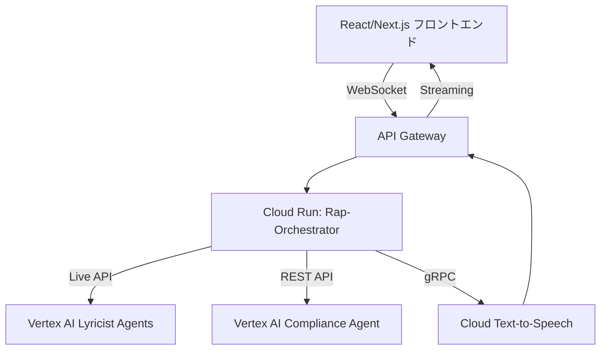

# Design Document (DD)

## 4. アーキテクチャ概要
# Product Requirements Document (PRD)

## 1. 概要

Google CloudのVertex AIとLive APIを用いて、AIがリアルタイムでラップバトルを生成するウェブアプリケーションを提供します。複数のLLMを使用して創造性と即応性を兼ね備えたリリックを生成し、自動コンプライアンス評価を経て、リアルタイムの音声読み上げ機能を提供します。

## 2. 目的

* 高品質かつ創造性の高いAI生成リリックをリアルタイムで提供。
* 自動コンプライアンス評価により安全性を担保。
* ユーザーエンゲージメントを高める直感的で魅力的なUIを提供。

## 3. 主要ペルソナ

* **視聴者**：エンターテインメント性を求める一般ユーザー。
* **参加者**：ラップテーマを指定してAIとのバトルを楽しむユーザー。
* **コンプライアンス管理者**：自動生成コンテンツの安全性と適合性を監視する管理者。

## 4. 機能要件

* 複数のLLM (Gemini Flash、Gemini 1.5 Pro) を活用したリリック生成。
* コンテンツのリアルタイムな自動コンプライアンス評価。
* Cloud Text-to-Speech APIを利用したリアルタイム音声ストリーミング。
* 視聴者によるリアルタイム投票機能。
* バトル終了後の分析・レポート機能。

## 5. 非機能要件

* **パフォーマンス**：リリック生成から音声出力までのレイテンシは1.5秒以下。
* **スケーラビリティ**：同時1万ユーザー、同時100バトルまで対応可能。
* **セキュリティ**：Google IAMを活用した適切な権限制御。
* **コンプライアンス**：SOC2、ISO27001に準拠。

## 6. 成功基準

| 指標               | 目標値      |
| ---------------- | -------- |
| 視聴時間の平均          | 8分以上     |
| 安全性違反率           | 0.5%未満   |
| エンドツーエンドレイテンシ    | 1500ms以下 |
| DAU 90日後のリテンション率 | 25%以上    |

## 7. マイルストーン

| 期限    | 成果物           |
| ----- | ------------- |
| 2週間後  | プロトタイプ        |
| 6週間後  | パブリックベータ版リリース |
| 12週間後 | 正式リリース（GA）    |

---

# Design Document (DD)

## 1. アーキテクチャ概要

## 2. コンポーネント詳細

### フロントエンド (React/Next.js)

* ライブテキスト表示、リアルタイム音声再生。
* 視聴者がリアルタイムで投票できるUI。
* リリックが表示されるごとに視覚的エフェクトを提供。

### バックエンド (Cloud Run: Rap-Orchestrator)

* Vertex AI Live API経由でのLLMエージェントの管理。
* コンプライアンス評価とテキスト音声化のプロセス管理。
* リアルタイムイベントストリームをフロントエンドへ提供。

### Lyricist Agent (Vertex AI)

* Gemini Flash：即時性を重視した短文リリック生成。
* Gemini 1.5 Pro：クリエイティブで高度なラップコンテンツを生成。

### Compliance Agent (Vertex AI)

* 自動的にコンテンツの安全性を評価。
* コンテンツが不適切な場合、自動で再生成をトリガー。
* コンプライアンスログを生成。

### Voice Performer (Cloud Text-to-Speech)

* リアルタイムで音声をストリーミング生成。
* ラップスタイルの音声を使用しユーザーエクスペリエンスを向上。

## 3. データフロー

1. フロントエンドがバトル開始をリクエスト。
2. バックエンドがVertex AI経由でリリック生成を開始。
3. リリックが生成され次第、コンプライアンスチェック。
4. 通過したリリックをリアルタイム音声化。
5. 音声データをフロントエンドにリアルタイムストリーミング。

## 4. コンプライアンス設計

* Vertex AIの自動安全性評価を利用。
* 管理ダッシュボードから安全基準の調整可能。
* リスク評価の結果は即時ログ化。

## 5. パフォーマンス・スケーラビリティ戦略

* Cloud Runをオートスケール可能な設計にする。
* Live APIはウェブソケットを利用し、高スループットを維持。

## 6. セキュリティ

* サービスアカウントに基づくIAM権限設定。
* ログとデータへのアクセスを適切に管理。

## 7. デプロイ・CI/CD

* Cloud Source RepositoryとCloud Buildを用いたCI/CD。
* フロントエンドはFirebase Hosting経由でデプロイ。

## 8. 観測性

* Cloud LoggingとError Reportingを利用。
* パフォーマンス指標はPrometheus/OpenTelemetry経由で収集。

## 9. リスクと対応策

| リスク         | 対応策                      |
| ----------- | ------------------------ |
| モデル品質低下     | プロンプト固定、定期評価             |
| ピーク時の遅延     | 事前にLive APIセッションをウォームアップ |
| 誤検出による誤ブロック | 多重チェック（AI＋ルールベース）を実施     |

以上の内容で、アプリケーションの明確性、スケーラビリティ、コンプライアンスを強化しました。

## 2. コンポーネント詳細

### フロントエンド (React/Next.js)

* ライブテキスト表示、リアルタイム音声再生。
* 視聴者がリアルタイムで投票できるUI。
* リリックが表示されるごとに視覚的エフェクトを提供。

### バックエンド (Cloud Run: Rap-Orchestrator)

* Vertex AI Live API経由でのLLMエージェントの管理。
* コンプライアンス評価とテキスト音声化のプロセス管理。
* リアルタイムイベントストリームをフロントエンドへ提供。

### Lyricist Agent (Vertex AI)

* Gemini Flash：即時性を重視した短文リリック生成。
* Gemini 1.5 Pro：クリエイティブで高度なラップコンテンツを生成。

### Compliance Agent (Vertex AI)

* 自動的にコンテンツの安全性を評価。
* コンテンツが不適切な場合、自動で再生成をトリガー。
* コンプライアンスログを生成。

### Voice Performer (Cloud Text-to-Speech)

* リアルタイムで音声をストリーミング生成。
* ラップスタイルの音声を使用しユーザーエクスペリエンスを向上。

## 3. データフロー

1. フロントエンドがバトル開始をリクエスト。
2. バックエンドがVertex AI経由でリリック生成を開始。
3. リリックが生成され次第、コンプライアンスチェック。
4. 通過したリリックをリアルタイム音声化。
5. 音声データをフロントエンドにリアルタイムストリーミング。

## 4. コンプライアンス設計

* Vertex AIの自動安全性評価を利用。
* 管理ダッシュボードから安全基準の調整可能。
* リスク評価の結果は即時ログ化。

## 5. パフォーマンス・スケーラビリティ戦略

* Cloud Runをオートスケール可能な設計にする。
* Live APIはウェブソケットを利用し、高スループットを維持。

## 6. セキュリティ

* サービスアカウントに基づくIAM権限設定。
* ログとデータへのアクセスを適切に管理。

## 7. デプロイ・CI/CD

* Cloud Source RepositoryとCloud Buildを用いたCI/CD。
* フロントエンドはFirebase Hosting経由でデプロイ。

## 8. 観測性

* Cloud LoggingとError Reportingを利用。
* パフォーマンス指標はPrometheus/OpenTelemetry経由で収集。

## 9. リスクと対応策

| リスク         | 対応策                      |
| ----------- | ------------------------ |
| モデル品質低下     | プロンプト固定、定期評価             |
| ピーク時の遅延     | 事前にLive APIセッションをウォームアップ |
| 誤検出による誤ブロック | 多重チェック（AI＋ルールベース）を実施     |

以上の内容で、アプリケーションの明確性、スケーラビリティ、コンプライアンスを強化しました。

