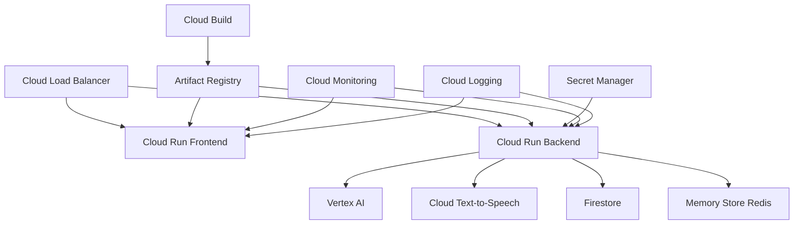

# AI Agent MC Battle - 利用 GCP サービス一覧

## コアサービス

### 1. **Cloud Run**
- **用途**: フロントエンド・バックエンドのホスティング
- **選定理由**: 
  - サーバーレスで自動スケーリング
  - WebSocket サポート
  - コンテナベースで移植性高い
- **構成**:
  - Frontend: 1 CPU, 2GB メモリ, 最小1インスタンス
  - Backend: 2 CPU, 4GB メモリ, 最小1インスタンス

### 2. **Vertex AI**
- **用途**: AI リリック生成
- **モデル**:
  - Gemini 2.5 Flash: 高速レスポンス用
  - Gemini 2.5 Pro: 高品質生成用
- **設定**:
  - リージョン: asia-northeast1
  - セーフティ設定: BLOCK_MEDIUM_AND_ABOVE

### 3. **Cloud Text-to-Speech**
- **用途**: リリックの音声合成
- **設定**:
  - 言語: en-US (ラップ用)
  - 音声: en-US-Studio-M
  - スピード: 1.2x
  - オーディオ形式: MP3

### 4. **Firestore**
- **用途**: データ永続化
- **コレクション**:
  - battles: バトル情報
  - users: ユーザー情報
  - lyrics: 生成リリック
  - votes: 投票データ
- **モード**: ネイティブモード

### 5. **Memory Store for Redis**
- **用途**: セッション管理・キャッシュ
- **スペック**:
  - バージョン: Redis 6.x
  - サイズ: Basic 1GB
  - 高可用性: スタンダードティア

## ネットワーク・セキュリティ

### 6. **Cloud Load Balancing**
- **用途**: トラフィック分散・SSL終端
- **タイプ**: Application Load Balancer (L7)
- **機能**:
  - URL ベースルーティング
  - WebSocket プロキシ
  - 自動 SSL 証明書管理

### 7. **Cloud Armor**
- **用途**: DDoS 防御・WAF
- **ルール**:
  - レート制限
  - 地理的制限
  - OWASP Top 10 防御

### 8. **Identity and Access Management (IAM)**
- **用途**: アクセス制御
- **主要ロール**:
  - Cloud Run Invoker
  - Vertex AI User
  - Firestore User

## 開発・運用ツール

### 9. **Artifact Registry**
- **用途**: Docker イメージ管理
- **リポジトリ**: ai-agent-mc-battle
- **フォーマット**: Docker

### 10. **Cloud Build**
- **用途**: CI/CD パイプライン
- **トリガー**:
  - main ブランチプッシュ時
  - Pull Request 作成時
- **ステップ**:
  - テスト実行
  - イメージビルド
  - デプロイ

### 11. **Secret Manager**
- **用途**: 機密情報管理
- **保存項目**:
  - API キー
  - JWT シークレット
  - データベース認証情報

## 監視・ロギング

### 12. **Cloud Monitoring**
- **用途**: メトリクス監視
- **主要メトリクス**:
  - レスポンス時間
  - エラー率
  - リソース使用率
  - API 使用量

### 13. **Cloud Logging**
- **用途**: ログ集約・分析
- **ログレベル**:
  - 本番: INFO 以上
  - 開発: DEBUG 以上

### 14. **Cloud Trace**
- **用途**: 分散トレーシング
- **追跡項目**:
  - API レイテンシ
  - サービス間通信
  - ボトルネック特定

### 15. **Cloud Profiler**
- **用途**: パフォーマンス分析
- **プロファイル対象**:
  - CPU 使用率
  - メモリ使用量
  - ヒープ分析

## コスト見積もり（月額）

### 最小構成（コスト最適化版）
```
Firebase Hosting:            $0 (無料枠)
Cloud Run (Backend):         $0-20 (最小インスタンス0)
Vertex AI (Gemini):          使用分のみ
Cloud Text-to-Speech:        使用分のみ
Firestore:                   $0 (無料枠内)
Redis (オプション):          $0 (開発時はメモリ使用)
-----------------------------------
合計:                        約 $0-50/月
```

### 基本構成（1000 DAU想定）
```
Firebase Hosting:            $0 (無料枠)
Cloud Run (Backend):         $30 (オートスケール)
Vertex AI (Gemini):          $100
Cloud Text-to-Speech:        $30
Firestore:                   $10
-----------------------------------
合計:                        約 $170/月
```

### スケール時（10,000 DAU）
```
Firebase Hosting:            $20
Cloud Run (Backend):         $300
Vertex AI (Gemini):          $1,000
Cloud Text-to-Speech:        $300
Firestore:                   $100
Memory Store (Redis):        $40 (Basic tier)
-----------------------------------
合計:                        約 $1,760/月
```

## サービス依存関係



## 推奨設定

### リージョン選択
- **プライマリ**: asia-northeast1 (東京)
- **セカンダリ**: asia-northeast2 (大阪) ※DR用

### 自動スケーリング設定
```yaml
Cloud Run Backend:
  minInstances: 1
  maxInstances: 100
  targetCPUUtilization: 60
  targetRequestCountPerInstance: 1000

Cloud Run Frontend:
  minInstances: 1
  maxInstances: 50
  targetCPUUtilization: 80
```

### バックアップ戦略
- Firestore: 日次自動バックアップ
- Redis: 定期スナップショット（6時間毎）

### セキュリティベストプラクティス
1. 最小権限の原則に基づく IAM 設定
2. VPC Service Controls でリソース境界設定
3. Cloud KMS でデータ暗号化
4. Binary Authorization でコンテナ署名検証